# Audio Classification Pipeline

Orchestrated with **Argo Workflows** on Kubernetes, tracked with **MLflow**, stored on **MinIO**, served via **Seldon Core**.

## Quick Start
1. Prerequisites: Docker Desktop, brew install k3d kubectl helm mc argo

1. Provision everything + upload data + build docker image

```bash
./scripts/provision-linux.sh # or ./scripts/provision-mac.sh if you are on a mac
```
3. Submit the Argo workflow (`deploy/k8s/argo-workflow.yaml`) from the UI 
- Click Submit new workflow 
- Copy paste the yaml file
- Click create

## What the Pipeline Does

```
download data → extract spectrograms → train CNN → evaluate → promote model → deploy (Seldon)
```

1. **Download** : pulls .wav/.txt files from MinIO bucket
2. **Extract** : parses labels, filters short segments (<50ms), computes 128-band Mel spectrograms
3. **Train** : trains 2D CNN (50 epochs), logs everything to MLflow
4. **Evaluate** : computes accuracy/precision/recall/F1 on held-out test set
5. **Promote** : if metrics pass thresholds AND beat current champion → sets MLflow alias "champion"
6. **Deploy** : applies SeldonDeployment to serve the champion model via REST API

## Project Structure

```
├── core/                    # All ML logic (extraction, training, evaluation, promotion)
│   ├── config.py            # Config dataclasses + YAML loader
│   ├── extraction.py        # Label parsing, spectrogram generation
│   ├── training.py          # CNN model + MLflow-tracked training
│   ├── evaluation.py        # Metrics + threshold gating
│   ├── promotion.py         # Compare vs champion, promote in MLflow
│   ├── serve.py             # model serving utility
│   └── pre_labeller.py      # Semi-automated labelling tool
├── deploy/
│   └── k8s/
│       ├── argo-workflow.yaml           # Pipeline DAG definition
│       └── manifests/
│           └── seldon-deployment.yaml   # Seldon model serving
├── configs/
│   └── pipeline_config.yaml # parameters
├── scripts/
    └── provision-linux.sh             # One-command: cluster + infra + data upload for linux
│   └── provision-mac.sh             # One-command: cluster + infra + data upload for mac
├── Dockerfile               # Pipeline container image
└── requirements.txt         # Python dependencies
```

## UIs

After provisioning, access the UIs via port-forward:

```bash
kubectl port-forward svc/mlflow 5000:5000 -n audio-classifier          # MLflow
kubectl port-forward svc/argo-workflows-server 2746:2746 -n audio-classifier  # Argo
kubectl port-forward svc/minio-console 9001:9001 -n audio-classifier    # MinIO
```

| Service | URL | Credentials |
|---------|-----|-------------|
| MLflow | http://localhost:5000 | none |
| Argo | http://localhost:2746 | none |
| MinIO | http://localhost:9001 | minioadmin / minioadmin123 |

## Configuration

All parameters in `configs/pipeline_config.yaml`:

- **extraction** : mel_bands, sample_rate, min_segment_duration
- **training** : epochs, batch_size, learning_rate, data splits
- **evaluation** : accuracy/precision/recall/F1 thresholds
- **mlflow** : tracking URI, experiment name, model name
- **storage** : MinIO endpoint, bucket, credentials

## Visualize pipeline
1. Minio Buckets created
- "pipeline-data" holds the training input data  
- "mlflow-artifacts" holds mlflow metadata and model artifacts
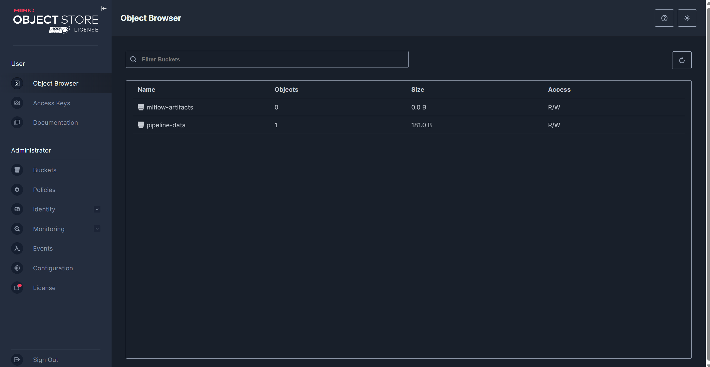

2. Workflow submitted (`deploy/k8s/argo-workflow.yaml`):
- Click Submit new workflow 
- copy paste the yaml file
- Click create
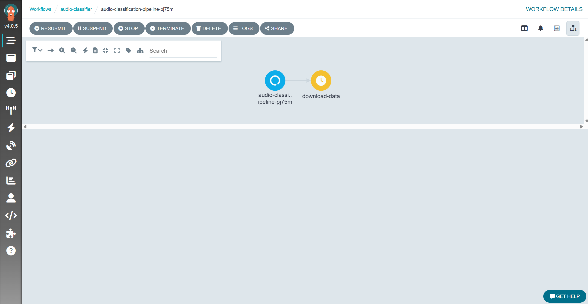

3. Follow the progress
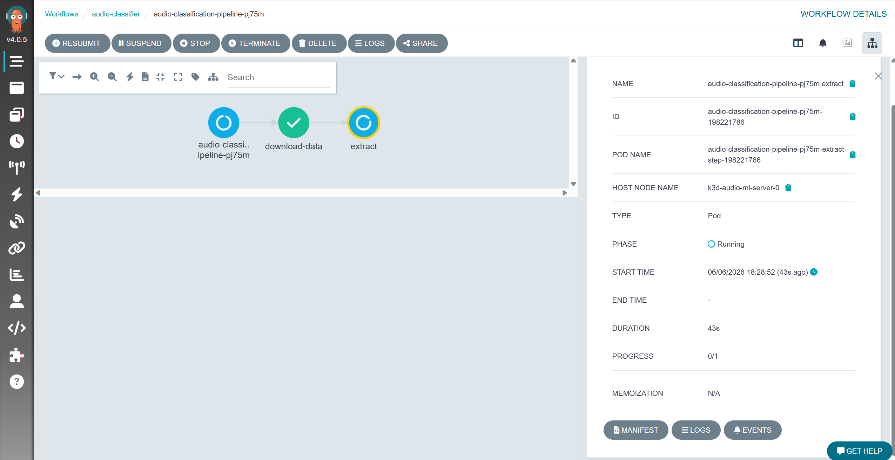

4. The training will be logged in MLFLOW
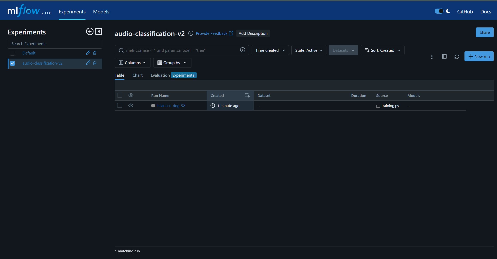

5. Full workflow
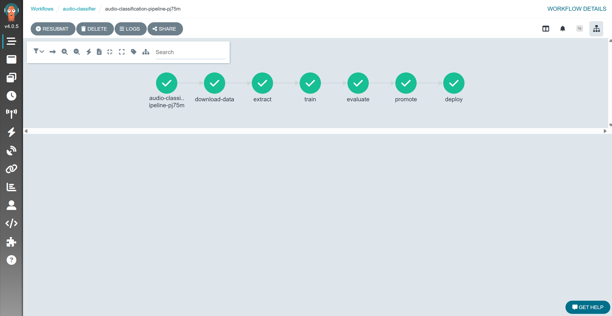

5. The model will also be logged and saved as an artifact
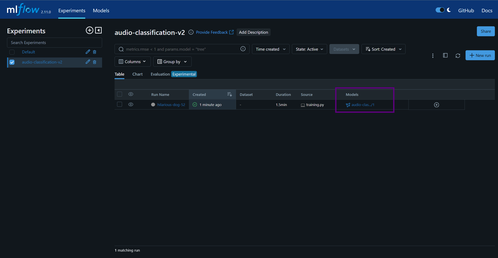

7. All metadata andd metrics gets logged as well for full traceability 
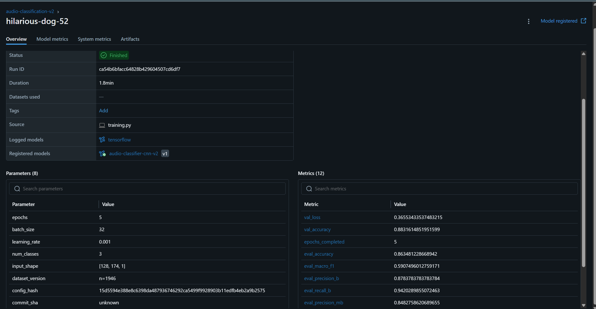

8. All model versions are saved, the best model is always promoted as `champion`:
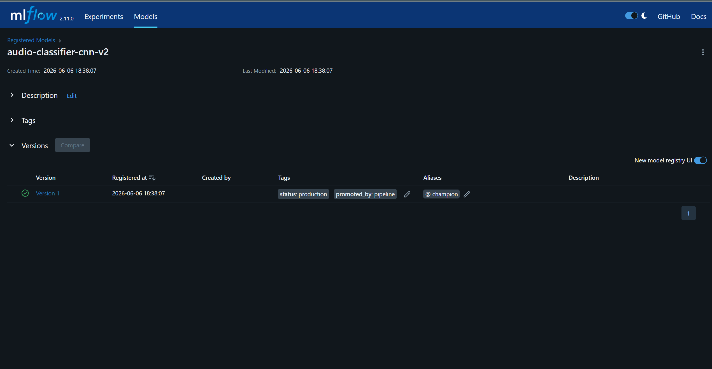

8. If the model evaluation fails, meaning the metrics didnt pass the threshold, the model will not be promoted as a champion and thus the deploy will be skipped:
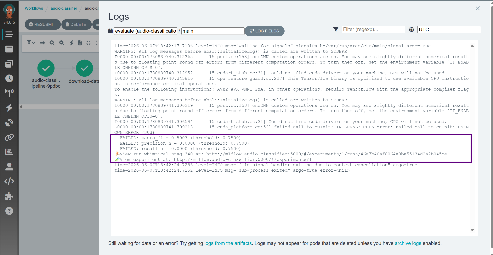
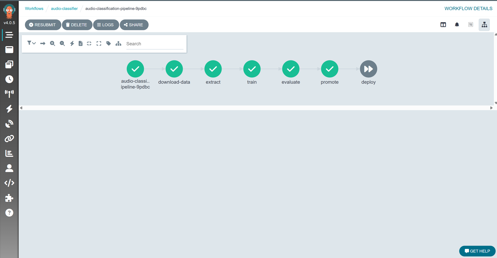


## Semi-Automated Labelling

The champion model is deployed and can be used now: 
```bash
kubectl port-forward svc/audio-classifier-default 9500:8000 -n audio-classifier &
```

The prelabeler tool, Segments audio, computes spectrograms, sends them to the Seldon endpoint, and outputs label files with confidence scores. Lines with confidence below the configured threshold are prefixed with a review marker [review]

```bash
python3 -m core.pre_labeller \
  --input AS_1.wav \
  --config configs/pipeline_config.yaml \
  --output draft_labels.txt \
  --endpoint http://localhost:9500
```

8. Pre_labeller in action:
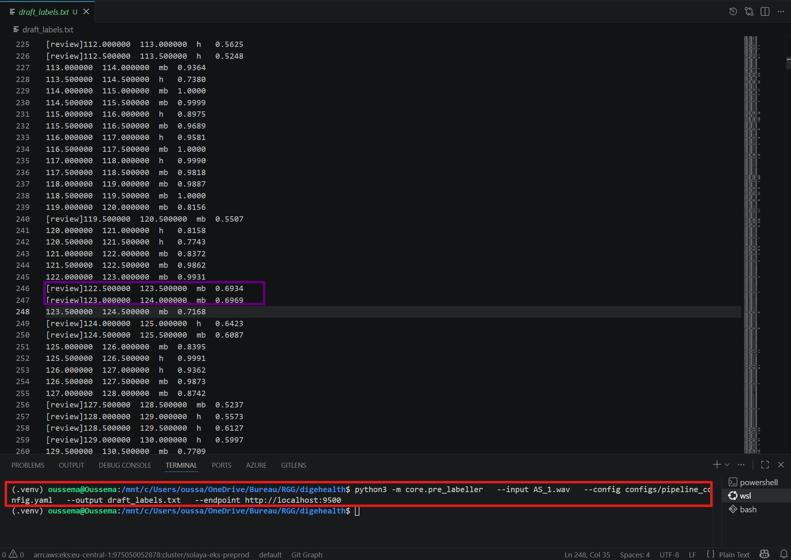


## [Thoughts] GCP Deployment (Alternative to Kubernetes)

The same `core/` code runs on GCP using managed services : no Kubernetes to manage:

### Component Mapping

| K8s (self-managed) | GCP (managed) | Role |
|---|---|---|
| Argo Workflows | Vertex AI Pipelines (KFP v2) | Pipeline orchestration |
| MinIO | Google Cloud Storage (GCS) | Artifact + data storage |
| MLflow | Vertex AI Experiments + Model Registry | Experiment tracking + model versioning |
| Seldon Core | Vertex AI Endpoints | Model serving |
| k3s / GKE | Vertex AI infrastructure | Compute |

### How to Use on GCP

The `core/` module is backend-agnostic. To run on GCP:

1. **Orchestration**  instead of Argo, we need to define a KFP v2 pipeline that calls the same `core.extraction`, `core.training`, `core.evaluation`, `core.promotion` modules.

2. **Serving** : instead of Seldon, we deploy via Vertex AI Endpoints:
   ```bash
   gcloud ai endpoints deploy-model ENDPOINT_ID \
     --model=MODEL_ID \
     --region=us-central1
   ```

3. **Storage** we use GCS buckets.

4. **Tracking** we replace MLflow with Vertex AI Experiments, or we run MLflow on GCE/Cloud Run pointing at GCS for artifacts.


## CI/CD Integration

### How CI/CD Makes This Easy

Every git push triggers automated build, test, and deployment:

```
git push → CI builds image → pushes to registry → triggers pipeline → model trained → promoted → deployed
```
### Change Traceability via Commit SHA

Every pipeline run records the git commit SHA that triggered it:

| Where | What's Recorded |
|-------|----------------|
| Argo Workflow parameter | `commit-sha` passed to every step |
| MLflow run params | `commit_sha` logged alongside hyperparams |
| Docker image tag | `audio-classifier-pipeline:<commit-sha>` |
| Seldon modelUri | Points to MLflow artifact created by that run |

To trace any deployed model back to code:
```
# 1. Find model version in MLflow UI → get run_id
# 2. In that run's params → commit_sha = "abc123"
# 3. git show abc123 → exact code that produced the model
```